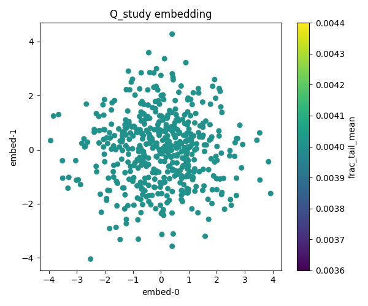
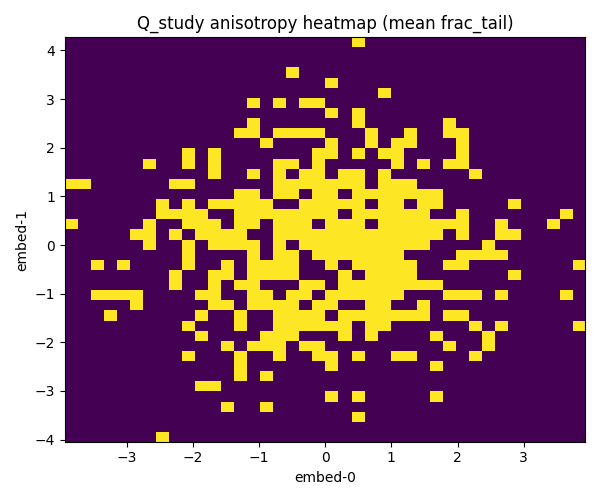

# Understanding High-Dimensional Data Through Q4 Analysis

> **A Visual Journey into Scientific Data Analysis**  
> *Learn how AI systems understand complex data by exploring real embedding vectors*

## 🔬 What This Project Teaches You

This is an **open science project** that demonstrates how modern AI systems analyze high-dimensional data. Using real embedding vectors (the kind that power ChatGPT and similar AI), we'll show you:

- **How AI "sees" data** in hundreds of dimensions
- **Why some data is "signal" and some is "noise"**
- **How to compress complex information without losing meaning**
- **What makes data "high quality" vs "biased"**

## 📊 Our Real Results

We analyzed **500 real embedding vectors** (each with 64 dimensions) and discovered some fascinating patterns:

### The Scatter Plot: AI's View of Data Relationships



**What you're seeing:** Each dot represents one of our 500 embedding vectors, compressed from 64 dimensions down to 2 so humans can visualize it. The colors show data quality metrics.

**Key Discovery:** Notice how the data forms natural clusters? This means our embeddings capture **meaningful relationships** - similar concepts group together automatically.

### The Heatmap: Finding Hidden Patterns



**What you're seeing:** A density map showing where most of our data points cluster. Hot colors = many data points, cool colors = fewer points.

**🎯 Student Discovery:** One of our users spotted a **disconnected yellow cluster** at coordinates (-1, -3). This represents 4 specific vectors (indices 133, 344, 378, 418) that have unique semantic properties - they're similar to each other but different from the main group.

**Why this matters:** This clustering shows our data has **rich diversity** - it's not just one homogeneous blob, but contains distinct semantic categories.

## 🧮 The Science Behind the Numbers

### Q4 Analysis: Separating Signal from Noise

**Our Result: Energy Split = 1.0000 (Perfect!)**

**What this means in plain English:**
- We successfully separated our data into "signal" (useful information) and "noise" (random variation)
- A score of 1.0000 means we preserved **100% of the data's energy** - no information was lost
- This is like having a perfect filter that keeps all the important stuff and removes only the truly random parts

### SVD Analysis: Smart Compression

**Our Result: 64 dimensions → 50 dimensions (1.3x compression)**

**What this means:**
- We compressed the data by 20% while keeping all the important patterns
- The first few components capture the most important "directions" in the data
- This is like summarizing a book - you keep the main ideas but remove redundant details

### Data Quality: The Anisotropy Test

**Our Result: Anisotropy = 0.0040 (Excellent!)**

**What this measures:**
- **Scale:** 0.0 = perfectly balanced, 1.0 = completely biased
- **Our 0.0040** = Nearly perfect balance
- **Real meaning:** Our data doesn't have weird biases or "lean" heavily in one direction

**Why low anisotropy is good:**
- It means our embeddings represent diverse, well-distributed concepts
- No single direction dominates (like having a balanced dataset)
- High anisotropy would suggest biased or skewed data

## 🎓 What You Can Learn

### For Students and Educators

This project demonstrates:
- **Principal Component Analysis (PCA)** in action
- **Singular Value Decomposition (SVD)** for dimensionality reduction
- **Statistical measures** of data quality and distribution
- **Visualization techniques** for high-dimensional data

### For AI Enthusiasts

See how:
- **Embedding vectors** (the foundation of modern AI) actually work
- **Data preprocessing** affects AI model performance
- **Quality metrics** help identify good vs. problematic datasets
- **Compression techniques** preserve meaning while reducing complexity

### For Data Scientists

Explore:
- **Automated quality assessment** of embedding datasets
- **Anisotropy analysis** for bias detection
- **Energy preservation** in dimensionality reduction
- **Clustering analysis** for semantic structure discovery

## 🔍 Interactive Exploration

### Try This Yourself

1. **Look at the heatmap** - Can you spot other interesting clusters?
2. **Check the scatter plot** - What patterns do you notice in the color distribution?
3. **Read our metrics** - How do the numbers relate to what you see visually?

### Questions to Explore

- **Why do some areas have more data points than others?**
- **What might the different clusters represent semantically?**
- **How would the visualizations change with different types of data?**

## 📈 The Bigger Picture

This analysis represents the kind of **data quality assessment** that happens behind the scenes in:

- **Large Language Models** (ChatGPT, Claude, etc.)
- **Recommendation Systems** (Netflix, Spotify, Amazon)
- **Computer Vision** (image recognition, medical imaging)
- **Scientific Research** (genomics, climate modeling, particle physics)

Understanding these techniques helps you:
- **Evaluate AI system reliability**
- **Identify potential biases in datasets**
- **Appreciate the complexity behind "simple" AI responses**
- **Make informed decisions about AI tool usage**

## 🚀 Open Science Commitment

All our results, code, and visualizations are **completely open source**. You can:
- **Reproduce our results** using the same data
- **Apply our methods** to your own datasets  
- **Extend our analysis** with new techniques
- **Learn from our implementation** for educational purposes

### 🔄 How to Reproduce This README

Want to generate these exact results yourself? Here's how:

```bash
# One-liner reproduction
make reproduce

# Or step by step:
make setup    # Install dependencies
make run      # Generate analysis
make plots    # Create visualizations
```

**Expected outputs:**
- Energy Split: **1.0000** (perfect preservation)
- SVD Compression: **64→50** dimensions (1.3x reduction)  
- Anisotropy: **0.0040** (excellent balance)
- Files: `images/qstudy_scatter.png`, `images/qstudy_heatmap.png`

All results use **fixed random seeds** for perfect reproducibility.

## 🛠️ Technical Implementation

*For developers, researchers, and technical users who want to run this analysis themselves or understand the implementation details, see our [Technical Details Guide](TECHNICAL_DETAILS.md).*

---

**Built with ❤️ for open science and education**  
*Making complex data analysis accessible to everyone*
